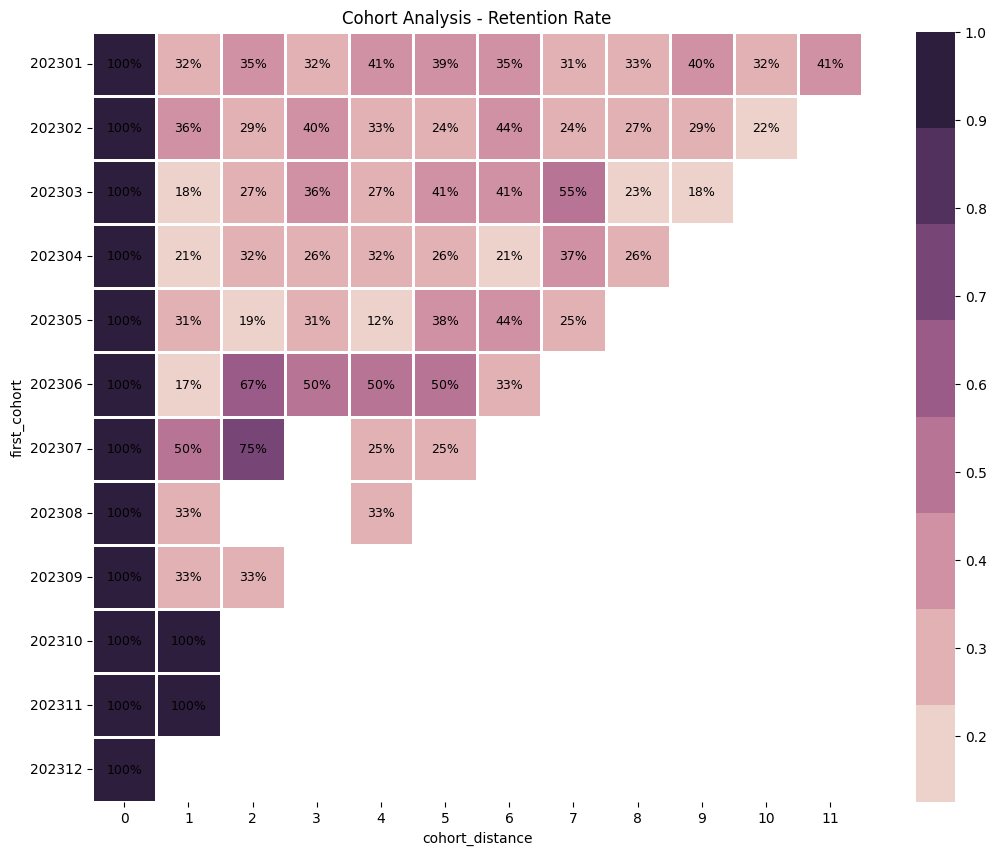

# Customer Cohort Retention Analysis


## Overview
This project analyzes customer retention behavior using **Cohort Analysis**. By grouping users based on their first transaction month, we track retention trends and visualize customer loyalty over time. This analysis helps businesses understand user engagement and churn patterns.

## Features
- **Data Loading:** Loads and cleans transaction datasets.
- **Cohort Generation:** Groups users based on their first purchase month (`first_cohort`).
- **Retention Calculation:** Calculates monthly retention rates for each cohort.
- **Visualization:** Generates an intuitive Heatmap using Seaborn to spot trends instantly.

## Technologies Used
- **Pandas** (Data Manipulation)
- **NumPy** (Numerical Operations)
- **Seaborn & Matplotlib** (Data Visualization)

## How to Use

1. **Clone this repository**
    ```bash
    git clone [https://github.com/](https://github.com/)[username]/Customer-Cohort-Retention-Analysis.git
    cd Customer-Cohort-Retention-Analysis
    ```
2. **Install requirements**
    ```bash
    pip install pandas numpy seaborn matplotlib
    ```
3. **Run the Notebook**
    - Open `Cohort.ipynb` in Jupyter Notebook/Lab.
    - Run the cells sequentially to process `data.csv` and generate the cohort chart.

## File Structure

| File         | Description                                      |
|--------------|--------------------------------------------------|
| Cohort.ipynb | Main Jupyter Notebook containing the analysis code |
| dummy_data.csv     | Transaction dataset (Anonymized/Dummy Data)      |
| LICENSE      | MIT License details                              |
| README.md    | Project documentation                            |

## Results
The analysis outputs a heatmap showing the percentage of active customers over time.


**Key Insights:**
- Identifies how long customers typically stay active.
- Highlights periods with the highest churn rates.
- Shows the effectiveness of acquisition campaigns in specific months.

## License
Distributed under the **MIT License**. See `LICENSE` file for more information.
